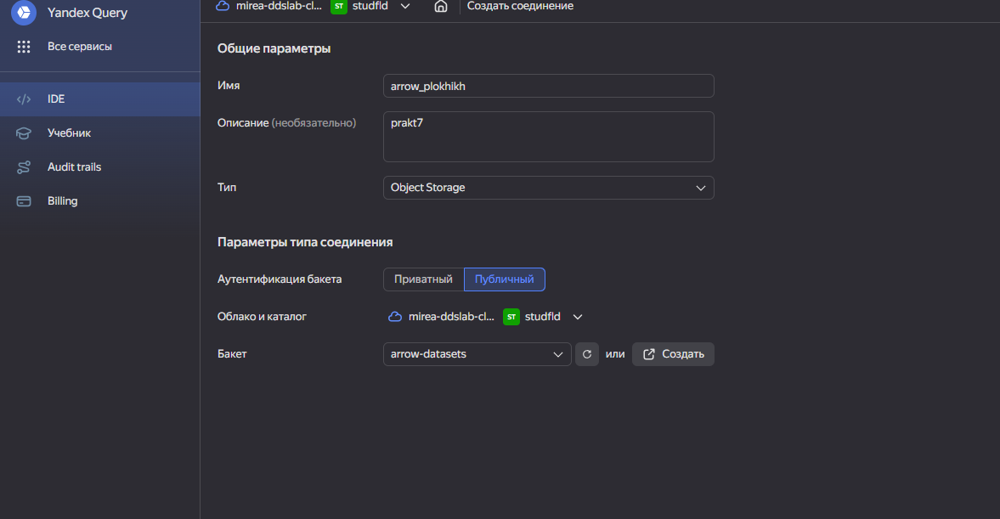
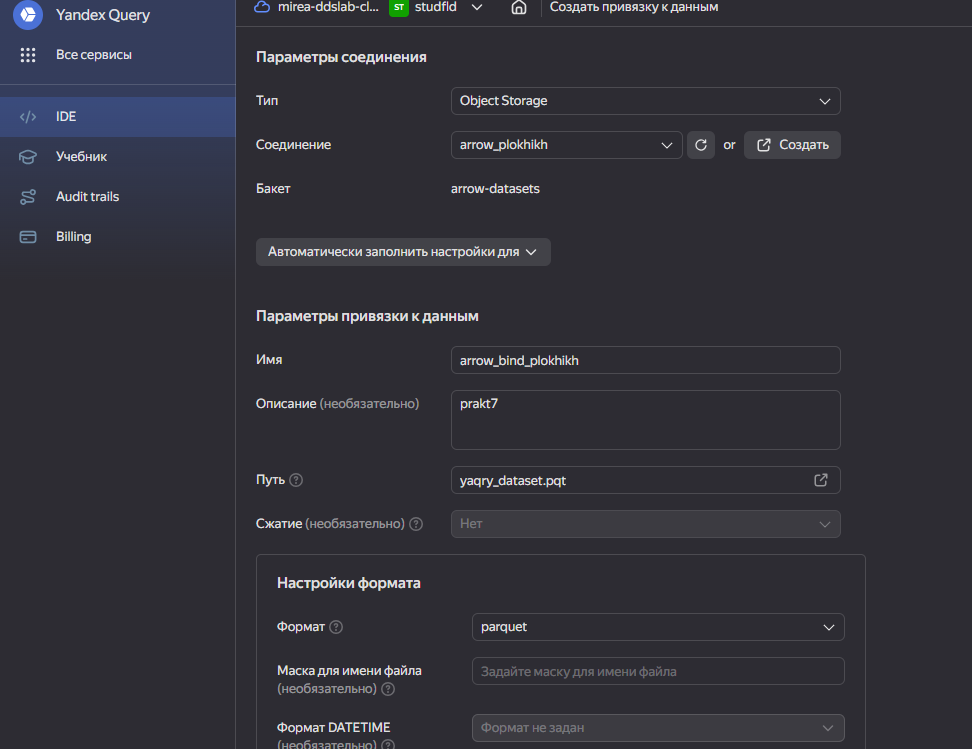
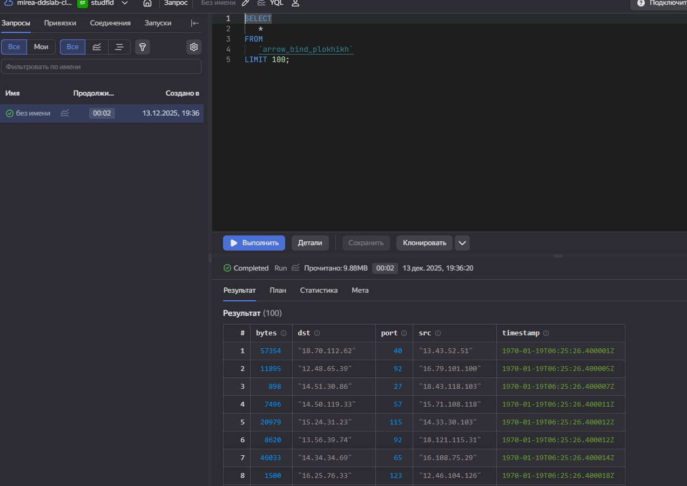
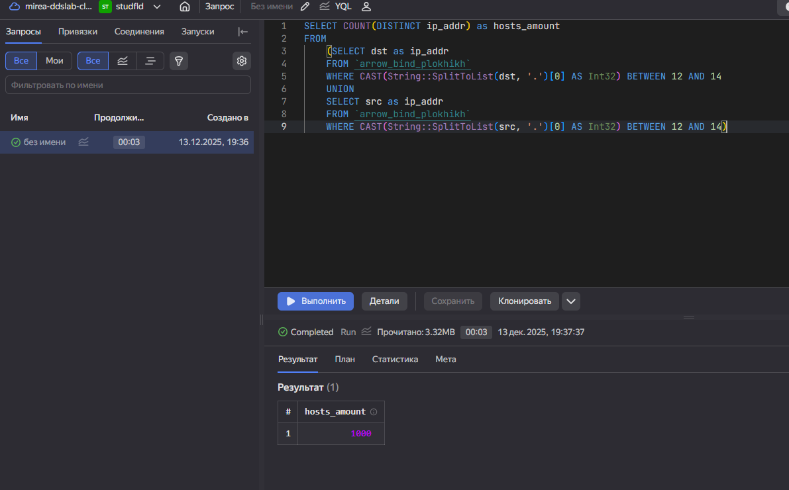
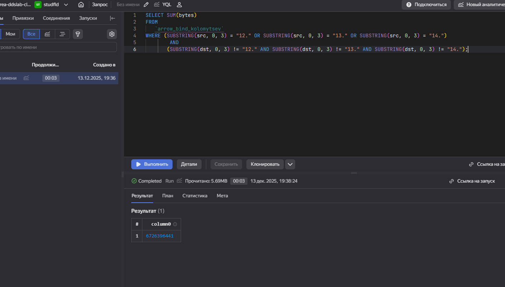
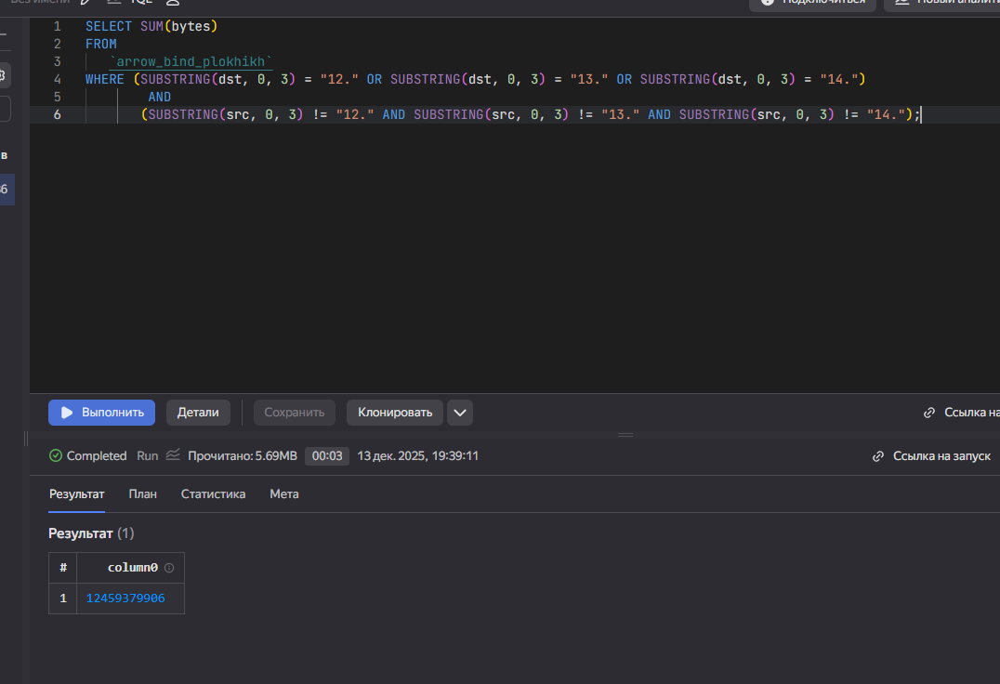

# 7 Практика
gleb.plokhikh@yandex.ru

## Цель работы

1.  Изучить возможности технологии `Yandex Query` для анализа
    структурированных наборов данных
2.  Получить навыки построения аналитического пайплайна для анализа
    данных с помощью сервисов `Yandex Cloud`
3.  Закрепить практические навыки использования SQL для анализа данных
    сетевой активности в сегментированной корпоративной сети

## Исходные данные

1.  Программное обеспечение Windows 11
2.  Rstudio Desktop

## Задание

Используя сервис `Yandex Query` настроить доступ к данным, хранящимся в
сервисе хранения данных `Yandex Object Storage`. При помощи
соответствующих SQL запросов ответить на вопросы.

## Ход работы

1.  Проверить доступность данных в `Yandex Object Storage`
2.  Подключить бакет как источник данных для `Yandex Query`
3.  Известно, что IP адреса внутренней сети начинаются с октетов,
    принадлежащих интервалу \[12-14\]. Определить количество хостов
    внутренней сети, представленных в датасете.
4.  Определить суммарный объем исходящего трафика
5.  Определить суммарный объем входящего трафика
6.  Оформление отчета

## Шаги

### 1. СОздать бакет как источник данных для Yandex Query

### 2. Создать привязку данных и настроить ее

#### 2.5 Проверка правильности подключения данных

### 3. Анализ

#### 3.1 Известно, что IP адреса внутренней сети начинаются с октетов, принадлежащих интервалу \[12-14\]. Определите количество хостов внутренней сети, представленных в датасете

Воспользуемся функцией `String::SplitToList` (также можно использовать
функцию `SUBSTRING`), чтобы разбить адрес в виде строки на список строк
с разделителем `.`, применим функцию к `dst` и к `src` и выберем
количество уникальных адресов.

Видим, что количество хостов в датасете - 1000.

#### 3.2. Определите суммарный объем исходящего трафика

#### 3.3. Определите суммарный объем входящего трафика

Обратная задача, нам необходимо поменять `dst` и `src` местами в
запросе:

## Вывод

Таким образом используя сервис `Yandex Query` мы настроили доступ к
данным, хранящимся в сервисе хранения данных `Yandex Object Storage` и
закрепили практические навыки использования SQL для анализа данных
сетевой активности в сегментированной корпоративной сети.
