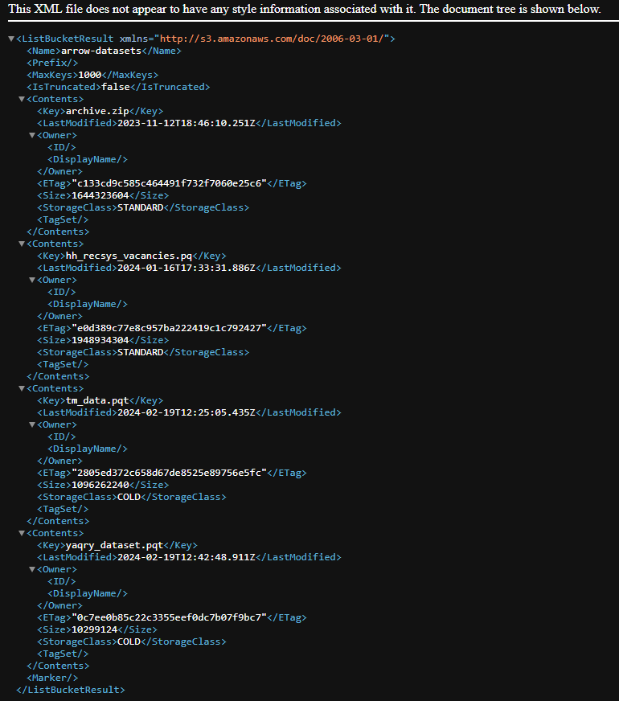

# Использование технологии Yandex Query для анализа данных сетевой
активности
gleb.plokhikh@yandex.ru

## Цель работы

1.  Изучить возможности технологии `Yandex Query` для анализа
    структурированных наборов данных
2.  Получить навыки построения аналитического пайплайна для анализа
    данных с помощью сервисов `Yandex Cloud`
3.  Закрепить практические навыки использования SQL для анализа данных
    сетевой активности в сегментированной корпоративной сети

## Исходные данные

1.  Программное обеспечение Windows 11
2.  Rstudio Desktop
3.  Данные сетевой активности в корпоративной сети компании XYZ,
    хранящиеся в `Yandex Object Storage`
4.  Сервисы `Yandex Cloud`

## Задание

Используя сервис `Yandex Query` настроить доступ к данным, хранящимся в
сервисе хранения данных `Yandex Object Storage`. При помощи
соответствующих SQL запросов ответить на вопросы.

## Ход работы

1.  Проверить доступность данных в `Yandex Object Storage`
2.  Подключить бакет как источник данных для `Yandex Query`
3.  Известно, что IP адреса внутренней сети начинаются с октетов,
    принадлежащих интервалу \[12-14\]. Определить количество хостов
    внутренней сети, представленных в датасете.
4.  Определить суммарный объем исходящего трафика
5.  Определить суммарный объем входящего трафика
6.  Оформление отчета

## Шаги

### 1. Проверить доступность данных в Yandex Object Storage

Перейдем по ссылке до бакета, чтобы убедиться в доступности данных:
https://storage.yandexcloud.net/arrow-datasets.



### 2. Подключить бакет как источник данных для Yandex Query

#### 2.1-2.2 Создать соединение для бакета в S3 хранилище и заполнить поля с учетом допустимых символов


#### 2.3-2.4 Создать привязку данных и настроить ее


Учитывая представленную схему настроим формат данных:

    SCHEMA=(
    timestamp TIMESTAMP NOT NULL,
    src STRING,
    dst STRING,
    port INT32,
    bytes INT32
    )


#### 2.5 Проверка правильности подключения

Выполним простой запрос:

``` sql
SELECT
   *
FROM
   `arrow_bind_kolomytsev`
LIMIT 100;
```

Получим следующие результаты:


### 3. Анализ

#### 3.1 Известно, что IP адреса внутренней сети начинаются с октетов, принадлежащих интервалу \[12-14\]. Определите количество хостов внутренней сети, представленных в датасете

Воспользуемся функцией `String::SplitToList` (также можно использовать
функцию `SUBSTRING`), чтобы разбить адрес в виде строки на список строк
с разделителем `.`, применим функцию к `dst` и к `src` и выберем
количество уникальных адресов.

``` sql
SELECT COUNT(DISTINCT ip_addr) as hosts_amount
FROM
    (SELECT dst as ip_addr
    FROM `arrow_bind_kolomytsev`
    WHERE CAST(String::SplitToList(dst, '.')[0] AS Int32) BETWEEN 12 AND 14
    UNION
    SELECT src as ip_addr
    FROM `arrow_bind_kolomytsev`
    WHERE CAST(String::SplitToList(src, '.')[0] AS Int32) BETWEEN 12 AND 14)
```


Видим, что количество хостов в датасете - 1000.

#### 3.2. Определите суммарный объем исходящего трафика

``` sql
SELECT SUM(bytes)
FROM 
   `arrow_bind_kolomytsev`
WHERE (SUBSTRING(src, 0, 3) = "12." OR SUBSTRING(src, 0, 3) = "13." OR SUBSTRING(src, 0, 3) = "14.")
        AND
       (SUBSTRING(dst, 0, 3) != "12." AND SUBSTRING(dst, 0, 3) != "13." AND SUBSTRING(dst, 0, 3) != "14.");
```


#### 3.3. Определите суммарный объем входящего трафика

Обратная задача, нам необходимо поменять `dst` и `src` местами в
запросе:

``` sql
SELECT SUM(bytes)
FROM 
   `arrow_bind_kolomytsev`
WHERE (SUBSTRING(dst, 0, 3) = "12." OR SUBSTRING(dst, 0, 3) = "13." OR SUBSTRING(dst, 0, 3) = "14.")
        AND
       (SUBSTRING(src, 0, 3) != "12." AND SUBSTRING(src, 0, 3) != "13." AND SUBSTRING(src, 0, 3) != "14.");
```


## Вывод

Таким образом используя сервис `Yandex Query` мы настроили доступ к
данным, хранящимся в сервисе хранения данных `Yandex Object Storage` и
закрепили практические навыки использования SQL для анализа данных
сетевой активности в сегментированной корпоративной сети.
